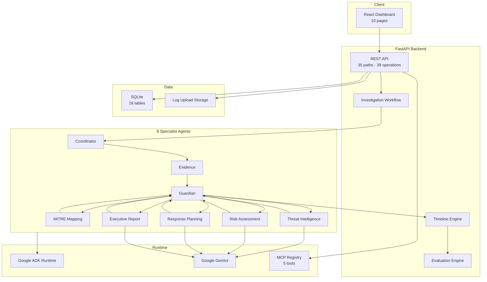
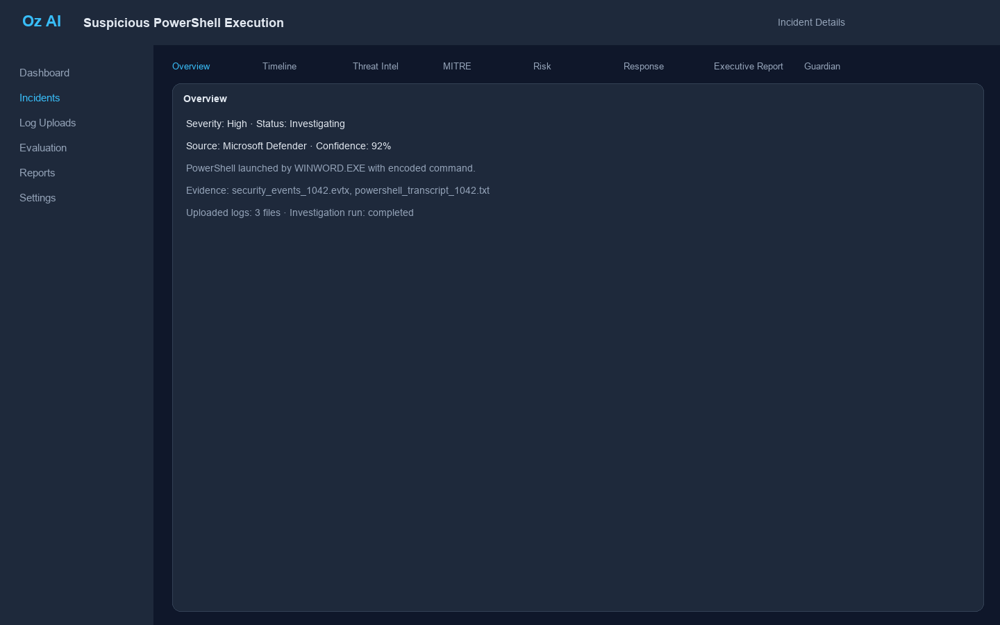
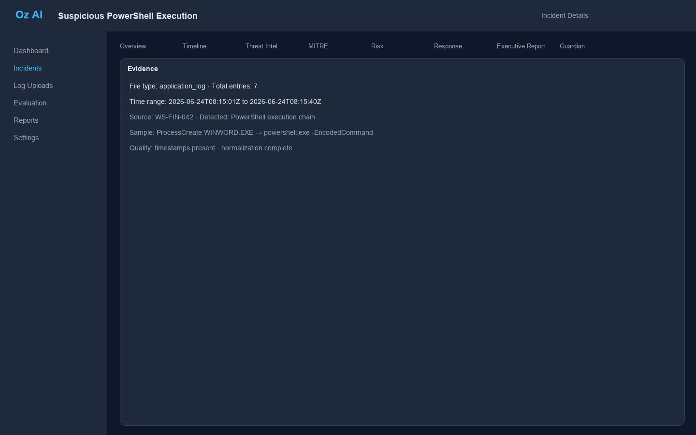
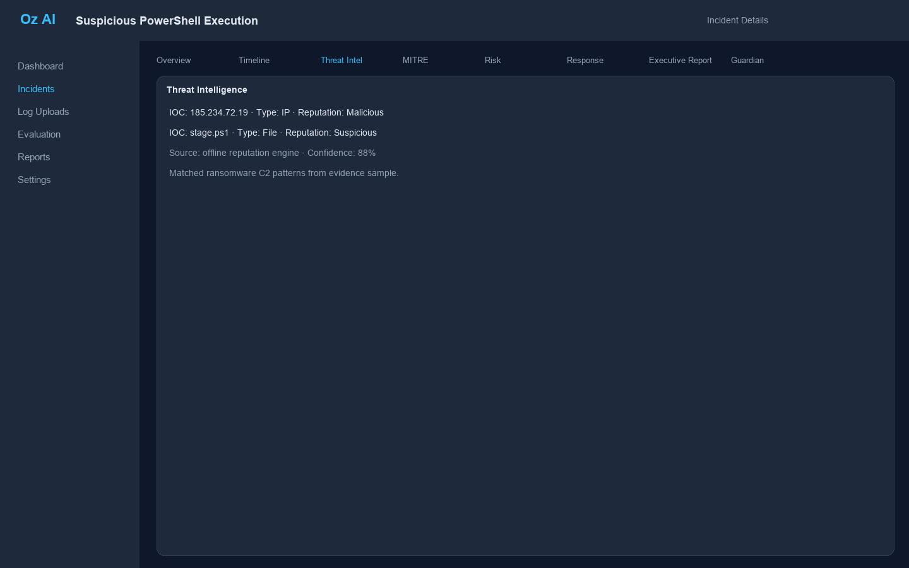
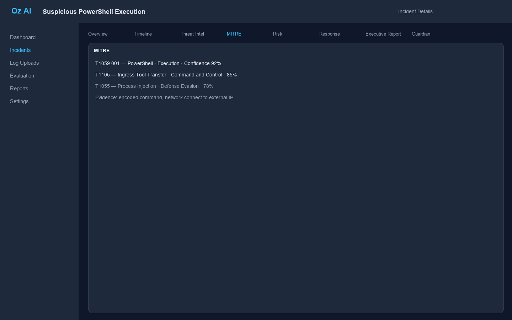
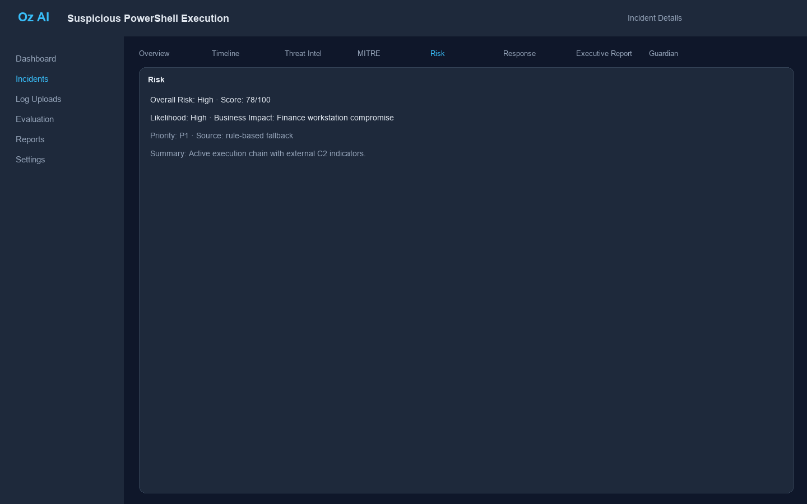
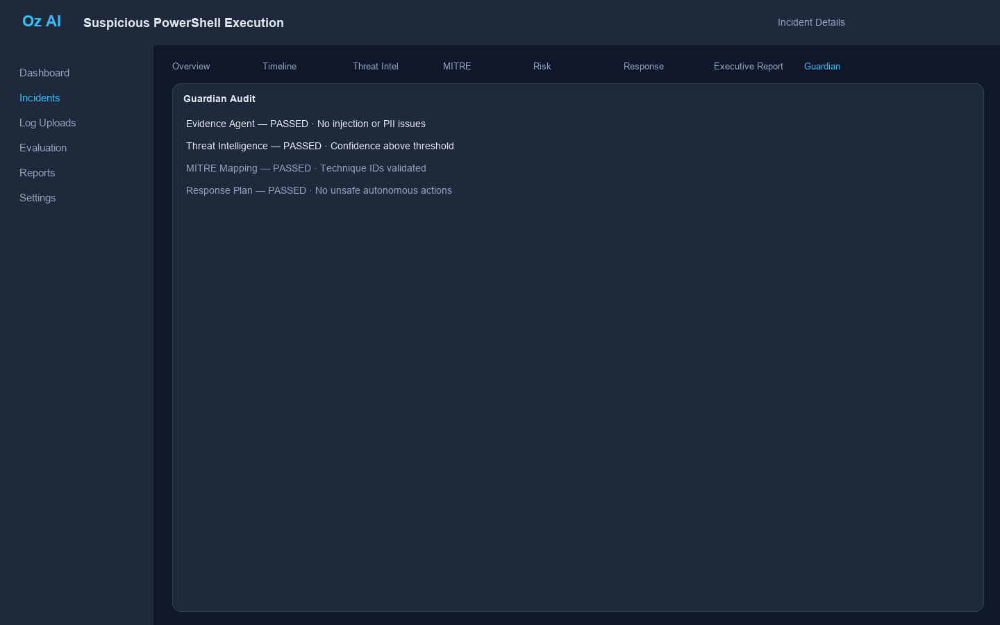
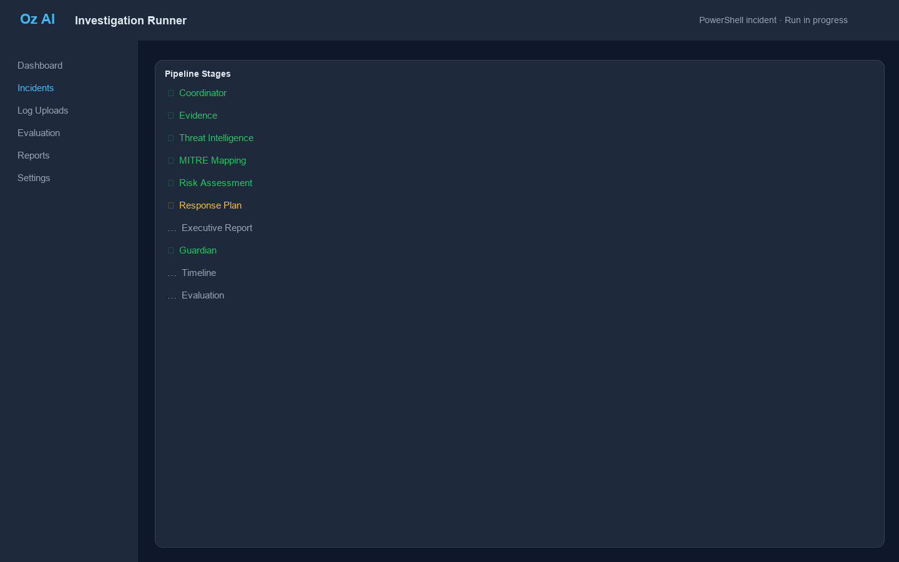
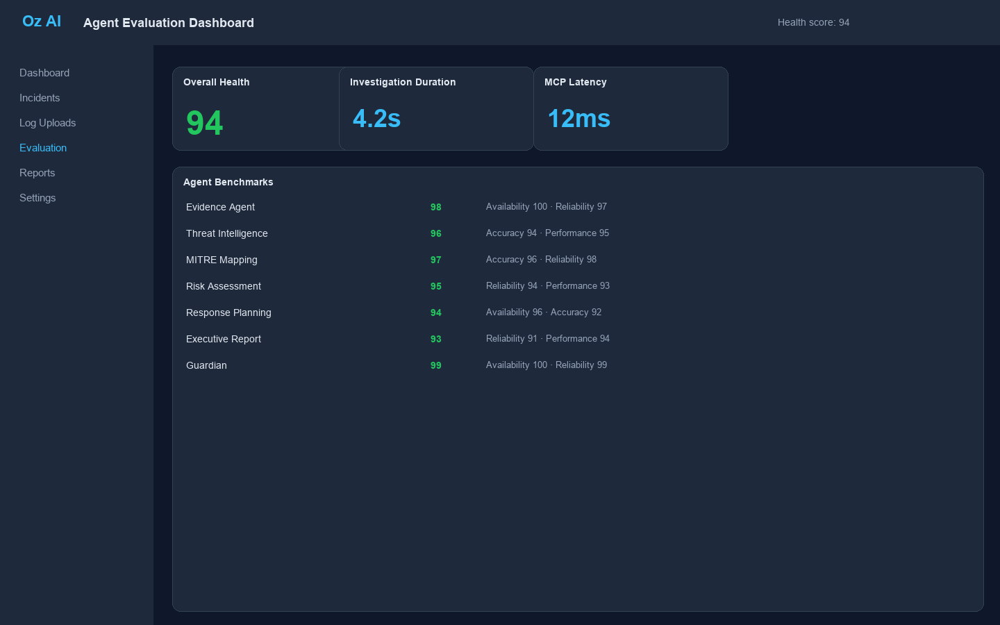

# Oz AI

**Multi-agent incident response for security teams.**

Oz AI is an open-source platform that coordinates specialist AI agents to investigate security incidents, validate outputs, and produce executive-ready reports.

---

[](https://www.python.org/downloads/)
[](https://fastapi.tiangolo.com/)
[](https://react.dev/)
[](https://docs.docker.com/compose/)
[](https://google.github.io/adk-docs/)
[](#mcp)
[](LICENSE)

---


---

## Table of Contents

- [Problem Statement](#problem-statement)
- [Solution](#solution)
- [Key Features](#key-features)
- [Architecture](#architecture)
- [Investigation Workflow](#investigation-workflow)
- [Technology Stack](#technology-stack)
- [Repository Structure](#repository-structure)
- [Installation](#installation)
- [Quick Start](#quick-start)
- [Demo](#demo)
- [Screenshots](#screenshots)
- [AI Architecture](#ai-architecture)
- [MCP](#mcp)
- [Google ADK](#google-adk)
- [Security](#security)
- [Evaluation](#evaluation)
- [Roadmap](#roadmap)
- [Known Limitations](#known-limitations)
- [Contributing](#contributing)
- [License](#license)
- [Acknowledgements](#acknowledgements)

---

## Problem Statement

Enterprise incident response is difficult for four recurring reasons:

1. **Slow triage** — Analysts spend hours parsing raw logs before they can assess scope or severity.
2. **Fragmented tooling** — SIEM alerts, threat intelligence feeds, ticketing systems, and executive reporting rarely share a single investigation context.
3. **Inconsistent analysis** — Output quality varies by analyst experience, shift, and available time.
4. **Poor executive communication** — Technical findings are rarely translated into business risk language that leadership can act on.

These gaps increase mean time to respond (MTTR) even when organizations have invested heavily in security tooling.

---

## Solution

Oz AI coordinates a fleet of specialist agents through a single investigation pipeline. Analysts upload log evidence, trigger an investigation, and receive structured outputs at each stage — IOC enrichment, MITRE ATT&CK mapping, risk assessment, response planning, and executive reporting.

Every specialist output passes through the **Guardian Agent** before the pipeline continues. After the agent chain completes, the **Timeline Engine** reconstructs chronological events and the **Evaluation Engine** scores agent performance.

Oz AI is a **decision-support system**. It produces recommendations; it does not execute remediation actions. Investigations are triggered explicitly via `POST /api/v1/investigations/run`.

---

## Key Features

### AI

- Eight Google ADK specialist agents orchestrated by a Coordinator
- AI-first execution with deterministic fallbacks when Gemini is unavailable
- Investigation replay with per-step `ai_used` and `fallback_used` flags
- Connectivity probe at `GET /api/v1/ai/test`

### Security

- Guardian validation after every specialist agent stage
- Prompt injection detection, PII masking, and secret scanning
- Schema compliance and mandatory field checks
- Configurable confidence thresholds (`MIN_AI_CONFIDENCE`)

### Investigation

- End-to-end workflow from log upload to executive report
- Support for `.log`, `.txt`, `.json`, `.csv`, and `.evtx` (metadata) files
- Offline reputation engine for IOC enrichment without external APIs
- Local MITRE ATT&CK rule matching

### Visualization

- React dashboard with ten pages covering the full analyst workflow
- Incident detail tabs for evidence, threat intel, MITRE, risk, response, and reports
- Timeline reconstruction from agent outputs
- Investigation runner and step-by-step replay views

### Reporting

- Executive reports in structured JSON and Markdown
- Risk narratives with severity scoring
- Response plans with containment, eradication, recovery, and monitoring steps
- Evaluation dashboard with per-agent health scores

---

## Architecture



Layer reference: [`docs/02_ARCHITECTURE.md`](docs/02_ARCHITECTURE.md) · Static diagram: [`docs/architecture/architecture.png`](docs/architecture/architecture.png)

---

## Investigation Workflow

```text
Upload
  ↓
Evidence
  ↓
Threat Intelligence
  ↓
MITRE
  ↓
Risk
  ↓
Response
  ↓
Executive Report
  ↓
Guardian          ← validates after each specialist stage
  ↓
Timeline
  ↓
Evaluation
```

The Coordinator Agent runs first to validate incident context and produce an execution plan. Guardian validates outputs between specialist stages. If Guardian rejects an AI output, the workflow continues using the agent's fallback path.

**Replay:** `GET /api/v1/investigations/{run_id}/replay`

---

## Technology Stack

| Layer | Technology |
|-------|------------|
| **Backend** | Python 3.12, FastAPI 0.138, SQLAlchemy, Pydantic v2, uvicorn |
| **Frontend** | React 19, TypeScript, Tailwind CSS, Vite 6 |
| **AI** | Google ADK, `google-genai` (Gemini 2.5 Pro) |
| **Database** | SQLite (single-file, demo-ready) |
| **Deployment** | Docker, Docker Compose |
| **Quality** | pytest (176 tests), Ruff, Black, TypeScript strict mode |

---

## Repository Structure

```text
Kaggle/
├── agents/                     # 8 specialist agent implementations
│   ├── coordinator/            # Orchestration and execution plans
│   ├── evidence/               # Log normalization
│   ├── threat_intelligence/    # IOC extraction and enrichment
│   ├── mitre/                  # ATT&CK mapping
│   ├── risk/                   # Risk assessment
│   ├── response/               # Response planning
│   ├── executive_report/       # Executive summaries
│   └── guardian/               # Safety validation
├── backend/
│   └── app/
│       ├── api/v1/             # REST endpoints
│       ├── models/             # SQLAlchemy ORM (16 tables)
│       ├── services/           # Business logic and workflow
│       ├── repositories/       # Data access layer
│       └── core/               # ADK, MCP, Guardian runtimes
├── frontend/src/               # React dashboard (10 pages)
├── mcp/                        # MCP registry and 5 tools
├── evaluation/                 # Benchmark and metrics engine
├── tests/                      # Integration and API tests
├── docs/
│   ├── architecture/           # Diagrams and sequence docs
│   ├── screenshots/            # UI screenshots
│   └── submission/             # Kaggle submission package
├── scripts/                    # dev.sh, reset_demo.py, asset generation
├── docker/                     # Dockerfile.backend, Dockerfile.frontend
├── docker-compose.yml
├── CONTRIBUTING.md
├── ROADMAP.md
└── README.md
```

| Metric | Count |
|--------|-------|
| API paths | 35 |
| API operations | 39 |
| AI agents | 8 |
| MCP tools | 5 |
| Database tables | 16 |
| Frontend pages | 10 |
| Automated tests | 176 |

Regenerate: `python scripts/generate_repo_stats.py`

---

## Installation

### Prerequisites

- Python 3.12+
- Node.js 20+
- Docker and Docker Compose (recommended)
- [uv](https://docs.astral.sh/uv/) (recommended for backend)

### Local

**Backend:**

```bash
cd backend
uv sync
uv run uvicorn app.main:app --reload --host 0.0.0.0 --port 8000
```

**Frontend:**

```bash
cd frontend
npm install
npm run dev
```

**Both services** (from repo root):

```bash
./scripts/dev.sh
```

### Docker

```bash
cp .env.example .env
docker compose up --build
```

| Service | Port | URL |
|---------|------|-----|
| Backend | 8000 | http://localhost:8000 |
| Frontend | 5173 | http://localhost:5173 |
| Swagger | 8000 | http://localhost:8000/docs |

Verify:

```bash
curl http://localhost:8000/api/v1/health
curl http://localhost:8000/api/v1/ai/test   # requires GOOGLE_API_KEY for Gemini
```

### Environment Variables

Copy `.env.example` to `.env`:

| Variable | Description | Default |
|----------|-------------|---------|
| `DATABASE_URL` | SQLAlchemy database URL | `sqlite:///./oz_ai.db` |
| `UPLOAD_DIR` | Log storage directory | `storage/uploads` |
| `MAX_UPLOAD_SIZE_BYTES` | Maximum upload size | `52428800` (50 MB) |
| `VITE_API_URL` | Frontend API base URL | `http://localhost:8000` |
| `GOOGLE_API_KEY` | Gemini API key (optional) | *(empty)* |
| `GOOGLE_MODEL` | Gemini model | `gemini-2.5-pro` |
| `ADK_APP_NAME` | ADK application identifier | `oz_ai` |
| `GUARDIAN_ENABLED` | Enable Guardian validation | `true` |
| `MIN_AI_CONFIDENCE` | Minimum AI confidence threshold | `70` |
| `MASK_SECRETS` | Mask detected secrets in outputs | `true` |
| `MASK_PII` | Mask detected PII in outputs | `true` |

Never commit `.env` files or API keys.

---

## Quick Start

Under five minutes with Docker:

```bash
git clone https://github.com/Jugnu0707/Kaggle.git
cd Kaggle
cp .env.example .env
docker compose up --build
```

Open http://localhost:5173.

Seed demo data (optional):

```bash
python scripts/reset_demo.py
```

This creates 10 incidents with 25 logs and runs investigations on showcase cases. Works fully offline without `GOOGLE_API_KEY`.

---

## Demo

```text
Dashboard
  ↓
Run Investigation
  ↓
Executive Report
  ↓
Evaluation
```

**Walkthrough:**

1. **Dashboard** — Review incident counts and recent activity at http://localhost:5173
2. **Run Investigation** — Incidents → *Suspicious PowerShell Execution* → **Investigate**, or use Investigation Runner
3. **Executive Report** — Open the Executive Report tab on the incident detail page
4. **Evaluation** — Navigate to `/evaluation` for per-agent health scores

**Demo reset:**

```bash
python scripts/reset_demo.py
```

Demo assets and scripts: [`docs/demo/`](docs/demo/) · Judge checklist: [`docs/kaggle/final_checklist.md`](docs/kaggle/final_checklist.md)

---

## Screenshots

| View | Preview |
|------|---------|
| Dashboard |  |
| Incident Details |  |
| Evidence |  |
| Threat Intelligence |  |
| MITRE Mapping |  |
| Risk Assessment |  |
| Response Plan |  |
| Executive Report |  |
| Guardian Audit |  |
| Timeline |  |
| Investigation Runner |  |
| Evaluation Dashboard |  |

Regenerate: `cd backend && uv run python ../scripts/generate_assets.py`

---

## AI Architecture

Oz AI implements eight specialist agents. Each agent has a defined input schema, output schema, service layer, and persistence model.

| Agent | Role | AI / Fallback | Output |
|-------|------|---------------|--------|
| **Coordinator** | Validate context and build execution plan | Rule-based | Orchestration plan |
| **Evidence** | Collect, normalize, and summarize uploaded logs | Rule-based | Evidence package |
| **Threat Intelligence** | Extract IOCs and enrich with reputation context | Gemini → offline reputation engine | IOC findings |
| **MITRE Mapping** | Map evidence to ATT&CK techniques | Rule-based (`mappings.py`) | Technique list |
| **Risk Assessment** | Score enterprise risk from investigation context | Gemini → rule scoring | Risk level and narrative |
| **Response Planning** | Draft containment, eradication, and recovery steps | Gemini → scenario playbooks | Response plan |
| **Executive Report** | Produce leadership-ready JSON and Markdown reports | Gemini → template engine | Executive report |
| **Guardian** | Validate outputs for safety, schema, and compliance | Rule-based | Audit record |

**Non-agent engines:**

| Engine | Role |
|--------|------|
| Timeline Engine | Reconstruct chronological events from agent outputs |
| Evaluation Engine | Score agent performance and persist metrics |

Agent implementations: [`agents/`](agents/) · Detailed reference: [`docs/kaggle/ai_agents.md`](docs/kaggle/ai_agents.md)

---

## MCP

Oz AI registers five operational MCP tools through an in-process registry at [`mcp/`](mcp/). Tools are introspectable via `GET /api/v1/system/mcp` and invokable through the MCP server runtime.

| Tool | Description |
|------|-------------|
| `health` | Return application health status |
| `list_incidents` | Return a paginated list of incidents |
| `incident_details` | Return details for a single incident |
| `list_logs` | Return uploaded log file metadata |
| `system_info` | Return version, database, ADK status, and MCP status |

Each tool defines typed input and output schemas via Pydantic models. Agents invoke backend services directly at runtime; MCP provides operational introspection and external tool access.

Reference: [`docs/architecture/mcp-interaction.md`](docs/architecture/mcp-interaction.md)

---

## Google ADK

The ADK runtime initializes at application startup in [`backend/app/core/adk_runtime.py`](backend/app/core/adk_runtime.py):

1. Verify the `google-adk` package imports successfully
2. Initialize the Coordinator Agent configuration
3. Register all eight agents in the AI runtime registry
4. Expose ADK status via health and system info endpoints

AI-first agents (Threat Intelligence, Risk, Response, Executive Report) call Gemini through `google-genai` when `GOOGLE_API_KEY` is set. When the key is missing, quota is exceeded, or the response is invalid, each agent falls back to its deterministic rule engine without blocking the workflow.

Configuration: `GOOGLE_API_KEY`, `GOOGLE_MODEL`, `ADK_APP_NAME`, `ADK_ENABLE_TRACING`

---

## Security

### Guardian

The Guardian Agent validates every specialist output between workflow stages:

- Prompt injection scanning
- PII detection and masking (`MASK_PII`)
- Secret detection and masking (`MASK_SECRETS`)
- JSON schema validation per agent
- Mandatory field completeness checks
- Confidence threshold enforcement (`MIN_AI_CONFIDENCE`)

Validation results are persisted to `guardian_audits` with status `approved`, `warning`, or `rejected`.

### Fallback

When Guardian rejects an AI output or Gemini is unavailable, agents use deterministic fallback paths:

| Agent | Fallback |
|-------|----------|
| Threat Intelligence | Offline reputation rules |
| Risk Assessment | Severity and technique-based scoring |
| Response Planning | Scenario playbooks |
| Executive Report | Template engine |

The workflow never blocks on AI failure.

### Validation

- Guardian can be disabled via `GUARDIAN_ENABLED=false` (not recommended for production)
- All validation events are append-only audit records
- Response plans are recommendations only — Oz AI does not execute remediation

Implementation: [`agents/guardian/`](agents/guardian/) · [`backend/app/services/orchestration_guardian.py`](backend/app/services/orchestration_guardian.py)

---

## Evaluation

Oz AI includes an offline evaluation framework that scores agent quality after each investigation.

| Component | Location |
|-----------|----------|
| Evaluation engine | `evaluation/engine.py` |
| Benchmark runner | `evaluation/benchmark.py` |
| Health scorer | `evaluation/scorer.py` |
| Metrics API | `GET /api/v1/evaluation` |
| Dashboard UI | `/evaluation` |

**Health score components** (weighted):

| Component | Weight | Measures |
|-----------|--------|----------|
| Availability | 30% | Success rate without hard failures |
| Reliability | 30% | Consistent success and low retry pressure |
| Performance | 20% | Mean execution time vs. 5 s target |
| Accuracy | 20% | Benchmark confidence or success rate |

Results persist to the `evaluation_metrics` table. Investigation replay records `ai_used` and `fallback_used` per step for transparency.

**Run tests:**

```bash
cd backend && uv run pytest
```

Reference: [`docs/kaggle/evaluation.md`](docs/kaggle/evaluation.md)

---

## Roadmap

### Current (v0.1.0)

- [x] FastAPI backend with 35 API paths
- [x] React dashboard with 10 pages
- [x] Eight Google ADK specialist agents
- [x] Guardian validation pipeline
- [x] MCP registry with 5 operational tools
- [x] Investigation workflow with replay
- [x] Timeline and Evaluation engines
- [x] Docker Compose deployment
- [x] Offline demo mode (`scripts/reset_demo.py`)

### Future

| Release | Focus |
|---------|-------|
| v0.2.0 | API authentication, RBAC, PostgreSQL, rate limiting |
| v0.3.0 | SIEM webhooks, SSO, multi-tenant isolation |
| v1.0.0 | Human approval gates, production MCP domain tools, CI regression gates |

Full roadmap: [`ROADMAP.md`](ROADMAP.md)

---

## Known Limitations

Oz AI is an MVP built for demonstration, evaluation, and capstone submission. Current constraints:

| Area | Limitation |
|------|------------|
| **Database** | SQLite — suitable for demos, not concurrent production workloads |
| **Authentication** | No API auth or RBAC; all endpoints are open |
| **Remediation** | Response plans are recommendations only; no automated execution |
| **Integrations** | No SIEM, webhook, or live threat feed connectors |
| **Threat intel** | Offline reputation rules; no VirusTotal or commercial feeds |
| **MITRE** | Local rule mappings; no auto-sync with MITRE ATT&CK API |
| **MCP** | Operational tools only; agents call services directly, not MCP at runtime |
| **Deployment** | Docker runs Vite dev server; no production Nginx build |
| **Scaling** | Single-process, in-memory agent execution; no worker queue |
| **Approval** | Human-in-the-loop gates are documented but not enforced in API or UI |

Full list: [`docs/kaggle/limitations.md`](docs/kaggle/limitations.md)

---

## Contributing

Contributions are welcome. See:

- [CONTRIBUTING.md](CONTRIBUTING.md) — setup, conventions, and pull request process
- [CODE_OF_CONDUCT.md](CODE_OF_CONDUCT.md)
- [SECURITY.md](SECURITY.md)

---

## License

MIT License — see [LICENSE](LICENSE).

---

## Acknowledgements

- **[Google](https://ai.google.dev/)** — Agent Development Kit (ADK) and Gemini
- **[Kaggle](https://www.kaggle.com/)** — AI Agents Intensive Capstone (Agents for Business track)
- **[MITRE ATT&CK](https://attack.mitre.org/)** — Threat framework reference
- **Open Source** — [FastAPI](https://fastapi.tiangolo.com/), [React](https://react.dev/), [Tailwind CSS](https://tailwindcss.com/), [Vite](https://vite.dev/), [uv](https://docs.astral.sh/uv/)
