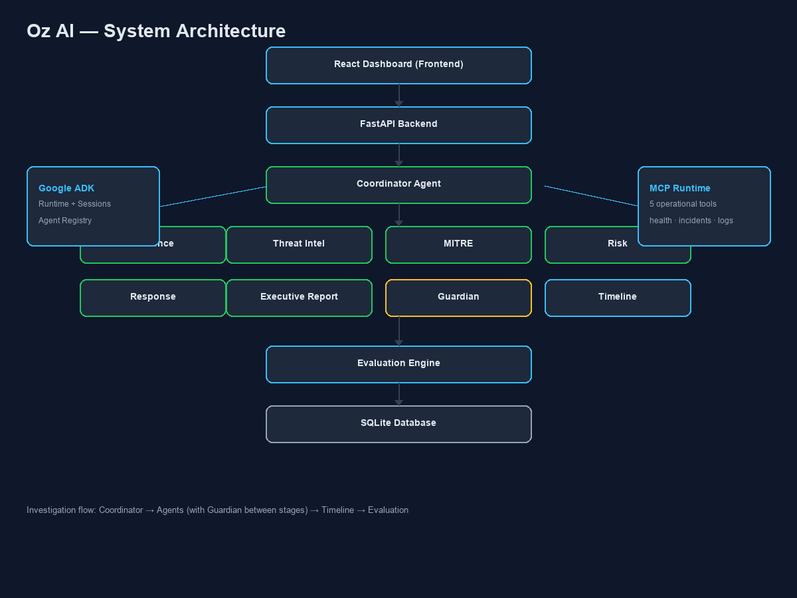
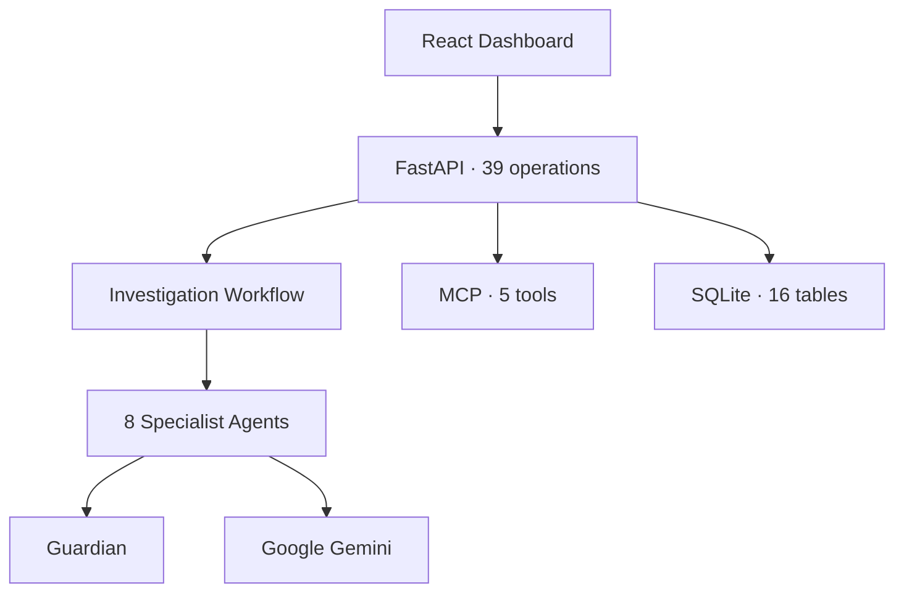
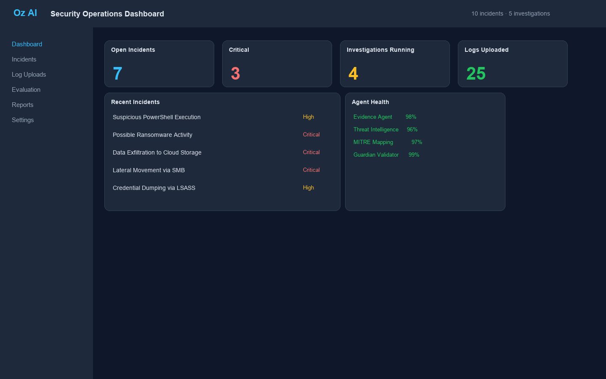
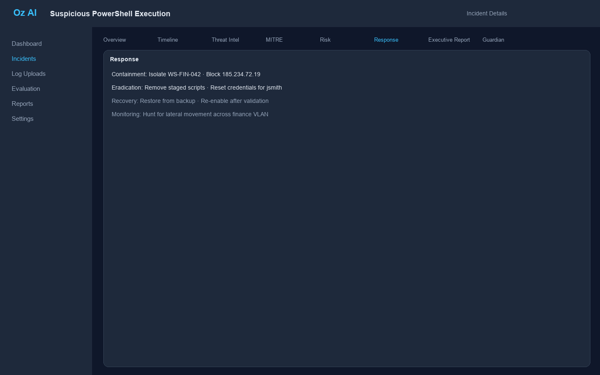
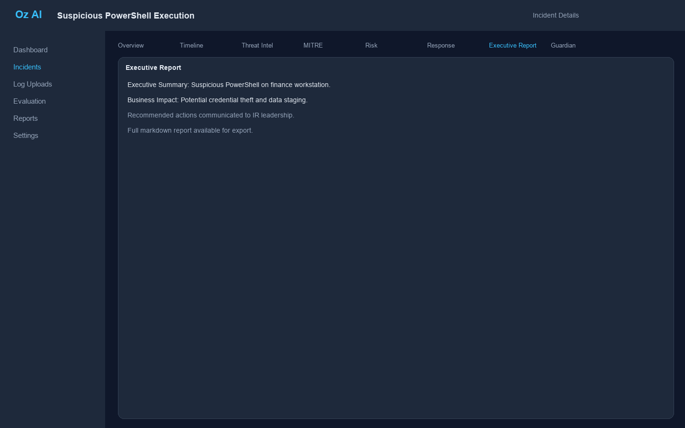
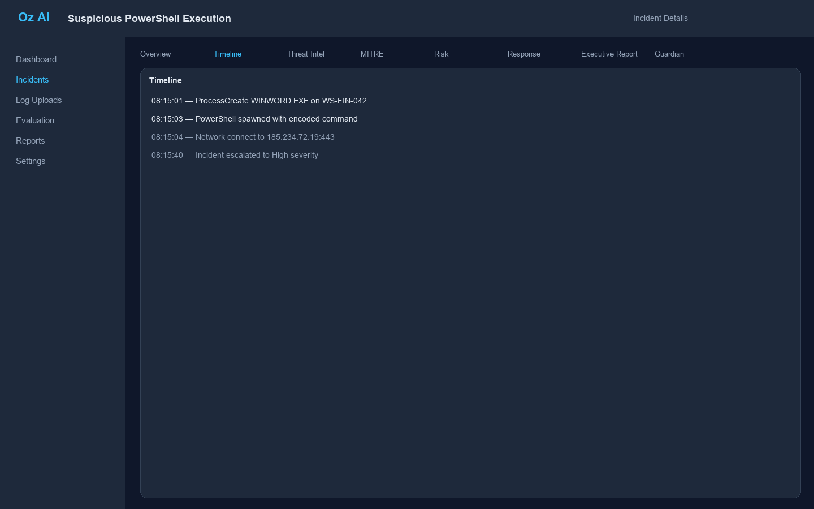

# Oz AI

[](LICENSE)
[](https://www.python.org/downloads/)
[](https://fastapi.tiangolo.com/)
[](https://react.dev/)
[](https://google.github.io/adk-docs/)
[](tests/)
[](https://www.kaggle.com/competitions)

**Enterprise Incident Response Platform** · v0.1.0 · Sprint 4 Task 1

Oz AI is an open-source, multi-agent platform for enterprise security incident response. It combines a FastAPI backend, React dashboard, eight Google ADK specialist agents, Guardian safety validation, MCP operational tools, and an end-to-end investigation workflow — built for the **Kaggle AI Agents Intensive Capstone** (Agents for Business track).

---

## Repository statistics

| Metric | Count |
|--------|-------|
| API paths | **35** |
| API operations | **39** |
| AI agents | **8** |
| Database tables | **16** |
| Frontend pages | **10** |
| MCP tools | **5** |
| Automated tests | **176** |

Regenerate: `python scripts/generate_repo_stats.py`

---

## Overview

Oz AI helps security teams investigate incidents faster by running a coordinated multi-agent pipeline:

1. Collect and normalize evidence from uploaded logs
2. Extract IOCs and enrich with threat intelligence
3. Map findings to MITRE ATT&CK techniques
4. Assess enterprise risk
5. Draft a structured response plan
6. Generate executive-ready reports
7. Validate every stage through the Guardian Agent
8. Reconstruct timelines and score agent performance

Investigations are triggered explicitly via `POST /api/v1/investigations/run`. Creating an incident does **not** automatically start the agent pipeline.

Oz AI is a **decision-support system**. Human approval gates for response actions are architecturally documented; API enforcement is planned for Sprint 4.

---

## Problem statement

Enterprise security teams face:

- **Slow triage** — Manual log review delays containment
- **Fragmented tooling** — SIEM, threat intel, and ticketing rarely share context
- **Inconsistent analysis** — Analyst skill varies across shifts and teams
- **Poor executive communication** — Technical findings rarely translate to business risk language

Mean time to respond (MTTR) remains high despite billions invested in security tooling.

---

## Solution

Oz AI deploys a **Coordinator-led fleet of specialist agents** that structure the entire investigation lifecycle:

| Stage | Agent | Output |
|-------|-------|--------|
| Plan | Coordinator | Execution plan |
| Collect | Evidence | Normalized log evidence |
| Enrich | Threat Intelligence | IOCs and reputation |
| Map | MITRE Mapping | ATT&CK techniques |
| Assess | Risk Assessment | Risk score and narrative |
| Respond | Response Planning | Containment and recovery plan |
| Report | Executive Report | CISO-ready summary |
| Validate | Guardian | Safety audit at every stage |

After the pipeline completes, the **Timeline Engine** reconstructs events and the **Evaluation Engine** scores agent outputs.

---

## Architecture



Detailed diagrams: [`docs/architecture/`](docs/architecture/)



Layer reference: [`docs/02_ARCHITECTURE.md`](docs/02_ARCHITECTURE.md)

---

## AI workflow

```text
Coordinator → Evidence → Guardian → Threat Intel → Guardian → MITRE → Guardian
  → Risk → Guardian → Response → Guardian → Executive Report → Guardian
  → Timeline Engine → Evaluation Engine
```

- **Replay & explainability:** `GET /api/v1/investigations/{run_id}/replay`
- **AI connectivity test:** `GET /api/v1/ai/test` (minimal token probe)
- **Offline capable:** Deterministic fallbacks when `GOOGLE_API_KEY` is unset

Sequence diagram: [`docs/architecture/investigation-sequence.md`](docs/architecture/investigation-sequence.md)

---

## Technology stack

| Layer | Technology |
|-------|------------|
| Backend | Python 3.12, FastAPI, SQLAlchemy, Pydantic v2 |
| Agents | Google ADK, `google-genai` (Gemini) |
| MCP | Custom in-process registry (`mcp/`) |
| Database | SQLite (MVP) |
| Frontend | React 19, TypeScript, Tailwind CSS, Vite |
| Infrastructure | Docker, Docker Compose |
| Quality | pytest, Ruff, Black, TypeScript strict |

---

## Folder structure

```text
Kaggle/
├── agents/                 # 8 specialist agent implementations
│   ├── coordinator/        # Orchestration and execution plans
│   ├── evidence/           # Log normalization
│   ├── threat_intelligence/  # IOC extraction and enrichment
│   ├── mitre/              # ATT&CK mapping
│   ├── risk/               # Risk assessment
│   ├── response/           # Response planning
│   ├── executive_report/   # Executive summaries
│   └── guardian/           # Safety validation
├── backend/
│   ├── app/                # FastAPI application
│   │   ├── api/v1/         # REST endpoints
│   │   ├── models/         # SQLAlchemy ORM (16 tables)
│   │   ├── services/       # Business logic and workflow
│   │   ├── repositories/   # Data access layer
│   │   └── core/           # ADK, MCP, Guardian runtimes
│   └── scripts/            # Demo seed scripts
├── frontend/src/           # React dashboard (10 pages)
├── mcp/                    # MCP registry and 5 tools
├── evaluation/             # Benchmark and metrics engine
├── tests/                  # Integration and API tests
├── docs/
│   ├── architecture/       # Diagrams and Mermaid docs
│   ├── demo/               # Screenshot gallery
│   └── COMPETITION_ALIGNMENT.md
├── scripts/                # reset_demo.py, dev.sh, asset generation
├── docker/                 # Dockerfile.backend, Dockerfile.frontend
├── docker-compose.yml
├── CONTRIBUTING.md
├── ROADMAP.md
└── README.md
```

---

## Installation

### Prerequisites

- Python 3.12+
- Node.js 20+
- Docker and Docker Compose (recommended)
- [uv](https://docs.astral.sh/uv/) (recommended for backend)

### Quick start

```bash
git clone https://github.com/Jugnu0707/Kaggle.git
cd Kaggle
cp .env.example .env
docker compose up --build
```

| Service | URL |
|---------|-----|
| Frontend | http://localhost:5173 |
| Backend API | http://localhost:8000 |
| Swagger docs | http://localhost:8000/docs |

---

## Docker setup

```bash
docker compose up --build
docker compose ps
curl http://localhost:8000/api/v1/health
curl http://localhost:8000/api/v1/ai/test
```

Services:

| Service | Port | Image |
|---------|------|-------|
| `backend` | 8000 | `docker/Dockerfile.backend` |
| `frontend` | 5173 | `docker/Dockerfile.frontend` |

Volumes persist SQLite database and uploaded logs between restarts.

---

## Local development

**Backend** (with uv):

```bash
cd backend
uv sync
uv run uvicorn app.main:app --reload --host 0.0.0.0 --port 8000
```

**Frontend:**

```bash
cd frontend
npm install
npm run dev
```

**Dev scripts** (from repo root):

```bash
./scripts/dev.sh              # Both services
./scripts/dev-backend.sh      # Backend only
./scripts/dev-frontend.sh     # Frontend only
```

**Tests:**

```bash
cd backend && uv run pytest
cd frontend && npm run build
```

---

## Demo mode

One-click demo reset for judges and reviewers:

```bash
python scripts/reset_demo.py
```

This wipes the local database and uploads, seeds **10 incidents** with **25 logs** (PowerShell execution, brute force, ransomware, credential dumping, suspicious outbound connections, DNS tunneling, malware download, lateral movement, privilege escalation, data exfiltration), runs investigations on showcase incidents, and populates all agent output tabs.

Without `GOOGLE_API_KEY`, agents use deterministic fallbacks — offline demos work fully; Gemini enriches AI-success paths when configured.

**Demo walkthrough:**

1. Dashboard → incident counts and recent activity
2. Incidents → **Suspicious PowerShell Execution**
3. Review tabs: Timeline, Threat Intel, MITRE, Risk, Response, Executive Report, Guardian
4. Investigation Runner → Run New Investigation
5. Investigation Replay → step through agent stages
6. Evaluation → agent health scores
7. Settings → health, ADK, and MCP status

Demo assets: [`docs/demo/`](docs/demo/)

---

## Screenshots

| View | Preview |
|------|---------|
| Dashboard |  |
| Incident Details |  |
| Threat Intelligence |  |
| MITRE Mapping |  |
| Risk Assessment |  |
| Response Plan |  |
| Executive Report |  |
| Guardian |  |
| Timeline |  |
| Evaluation |  |

Regenerate: `python scripts/generate_assets.py`

---

## Evaluation

Oz AI includes a structured evaluation framework:

| Component | Location |
|-----------|----------|
| Evaluation engine | `evaluation/engine.py` |
| Benchmark runner | `evaluation/benchmark.py` |
| Metrics API | `GET /api/v1/evaluation` |
| Dashboard UI | `/evaluation` |

Offline benchmarks produce precision/recall metrics per agent. Results persist to the `evaluation_metrics` table and surface in the Evaluation dashboard.

---

## Environment variables

Copy `.env.example` to `.env`:

| Variable | Description | Default |
|----------|-------------|---------|
| `DATABASE_URL` | SQLAlchemy database URL | `sqlite:///./oz_ai.db` |
| `UPLOAD_DIR` | Log storage directory | `storage/uploads` |
| `VITE_API_URL` | Frontend API base URL | `http://localhost:8000` |
| `GOOGLE_API_KEY` | Gemini API key (optional) | *(empty)* |
| `GOOGLE_MODEL` | Gemini model | `gemini-2.5-pro` |
| `GUARDIAN_ENABLED` | Enable Guardian validation | `true` |
| `MIN_AI_CONFIDENCE` | Minimum AI confidence threshold | `70` |

Never commit `.env` files or API keys.

---

## Competition alignment

**Competition:** Kaggle AI Agents Intensive Capstone · **Track:** Agents for Business

| Dimension | Implementation | Location |
|-----------|----------------|----------|
| Google ADK | Runtime, agent registry, Gemini integration | `agents/`, `backend/app/core/adk_runtime.py` |
| MCP | 5 operational tools, registry, API introspection | `mcp/`, `GET /api/v1/system/mcp` |
| Multi-agent | 8 agents + Coordinator orchestration | `agents/`, `POST /investigations/run` |
| Security | Guardian: injection, PII, schema, confidence | `agents/guardian/` |
| Business impact | Enterprise incident response / MTTR | `docs/01_PROJECT_BRIEF.md` |
| Evaluation | Offline benchmarks + API dashboard | `evaluation/`, `/evaluation` |
| Deployability | Docker Compose + demo reset | `docker-compose.yml`, `scripts/reset_demo.py` |
| Human-in-the-loop | Documented; API enforcement Sprint 4 | `docs/02_ARCHITECTURE.md` |

Full mapping: [`docs/COMPETITION_ALIGNMENT.md`](docs/COMPETITION_ALIGNMENT.md)

---

## Roadmap

| Sprint | Status | Focus |
|--------|--------|-------|
| Sprint 1 — Foundation | Complete | Backend, frontend, Docker, CRUD |
| Sprint 2 — ADK & MCP | Complete | ADK runtime, MCP, Coordinator, Evidence |
| Sprint 3 — Agents | Complete | 6 agents, Guardian, Timeline, Evaluation, Workflow |
| Sprint 3.5 — Competition prep | Complete | Hardening, demo assets, doc sync |
| Sprint 4 — Release hardening | In progress | Auth, approval, datasets, submission |

See [`ROADMAP.md`](ROADMAP.md) for v0.2.0+ plans.

---

## Documentation

| Document | Description |
|----------|-------------|
| [`docs/01_PROJECT_BRIEF.md`](docs/01_PROJECT_BRIEF.md) | Vision, goals, competition context |
| [`docs/02_ARCHITECTURE.md`](docs/02_ARCHITECTURE.md) | Authoritative architecture reference |
| [`docs/architecture/`](docs/architecture/) | Diagrams and sequence documentation |
| [`docs/COMPETITION_ALIGNMENT.md`](docs/COMPETITION_ALIGNMENT.md) | Kaggle requirement mapping |
| [`docs/07_SUBMISSION_CHECKLIST.md`](docs/07_SUBMISSION_CHECKLIST.md) | Pre-submission checklist |
| [`docs/REPOSITORY_READINESS_REPORT.md`](docs/REPOSITORY_READINESS_REPORT.md) | Repository audit report |
| [`CHANGELOG.md`](CHANGELOG.md) | Release history |

---

## Contributing

We welcome contributions. See [CONTRIBUTING.md](CONTRIBUTING.md), [CODE_OF_CONDUCT.md](CODE_OF_CONDUCT.md), and [SECURITY.md](SECURITY.md).

---

## License

MIT License — see [LICENSE](LICENSE).

---

## Acknowledgements

- [Kaggle](https://www.kaggle.com/) — AI Agents Intensive Capstone
- [Google Agent Development Kit (ADK)](https://google.github.io/adk-docs/) — Agent orchestration framework
- [Google Gemini](https://ai.google.dev/) — LLM inference
- [MITRE ATT&CK](https://attack.mitre.org/) — Threat framework reference
- [FastAPI](https://fastapi.tiangolo.com/) · [React](https://react.dev/) · [Tailwind CSS](https://tailwindcss.com/)
