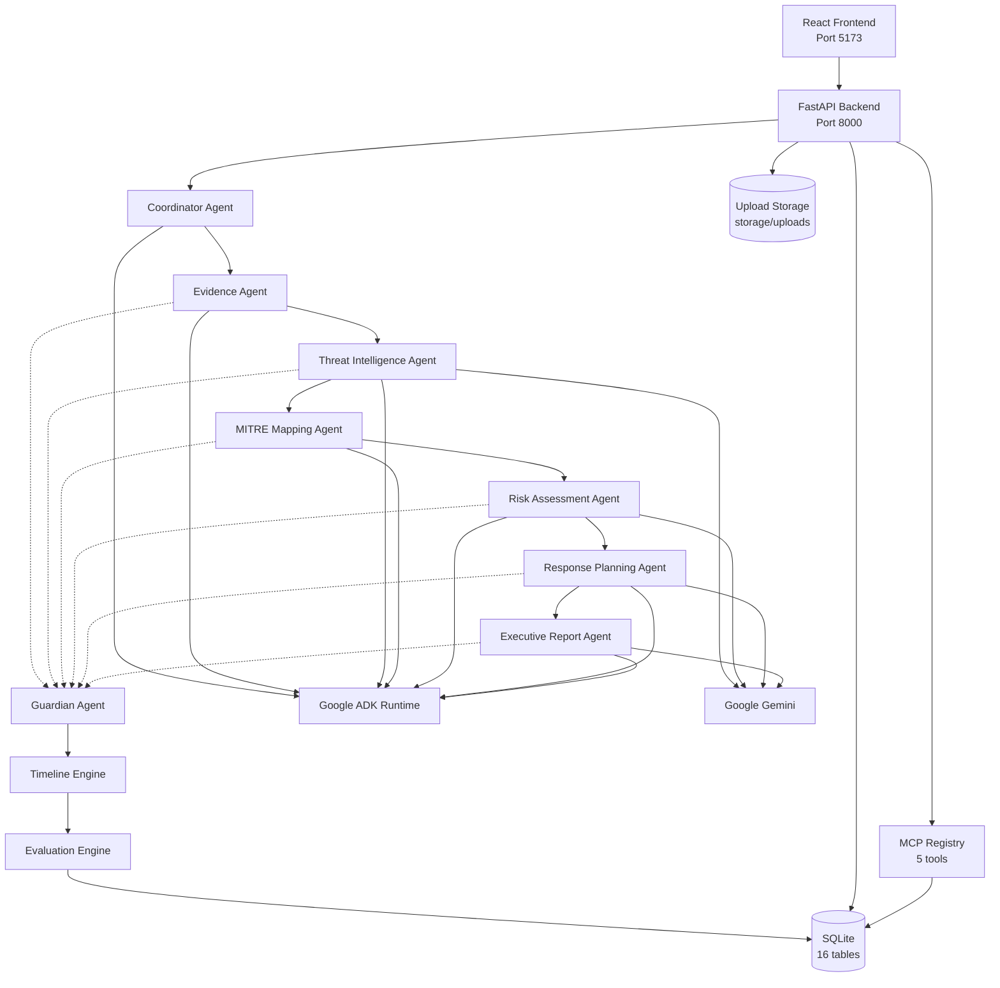

# Component Diagram

**Related:** [System Overview](01_system_overview.md) · [Agent Workflow](04_agent_workflow.md) · [Deployment](09_deployment.md)

This diagram shows the primary runtime components and the investigation pipeline data flow. Guardian validates outputs after each specialist stage; the linear view below emphasizes the post-pipeline processing order.

---

## Component Architecture

---

## Component Descriptions

| Component | Description |
|-----------|-------------|
| **React Frontend** | Ten-page dashboard. Proxies API calls to FastAPI during development. |
| **FastAPI Backend** | 35 API paths, 39 operations. Hosts workflow orchestration and agent services. |
| **Coordinator** | Validates incident context and produces an execution plan. Rule-based. |
| **Evidence** | Normalizes uploaded logs. Rule-based parsing. |
| **Threat Intelligence** | Extracts IOCs and enriches reputation. Gemini with offline fallback. |
| **MITRE** | Maps evidence to ATT&CK techniques. Local rule engine. |
| **Risk** | Scores enterprise risk. Gemini with rule fallback. |
| **Response** | Drafts containment and recovery plan. Gemini with playbook fallback. |
| **Executive Report** | Produces JSON and Markdown reports. Gemini with template fallback. |
| **Guardian** | Validates every specialist output (injection, PII, secrets, schema, confidence). |
| **Timeline Engine** | Reconstructs chronological events from persisted agent outputs. |
| **Evaluation Engine** | Computes health scores and writes `evaluation_metrics`. |
| **SQLite** | Single-file database. Docker volume at `/app/data/oz_ai.db`. |
| **Upload Storage** | Log files on disk. Docker volume at `/app/storage/uploads`. |
| **Google ADK** | Agent framework. Initializes Coordinator and agent configurations. |
| **Google Gemini** | LLM for four AI-first agents when `GOOGLE_API_KEY` is set. |
| **MCP Registry** | In-process tool registry. Operational introspection, not primary agent I/O path. |

---

## Integration Notes

- Agents invoke backend services directly; MCP tools are infrastructure-only in v0.1.0.
- Guardian runs between specialist stages via `orchestration_guardian.run_stage_with_guardian`.
- Timeline and Evaluation are workflow stages, not ADK agents.
- See [04_agent_workflow.md](04_agent_workflow.md) for per-agent detail.
