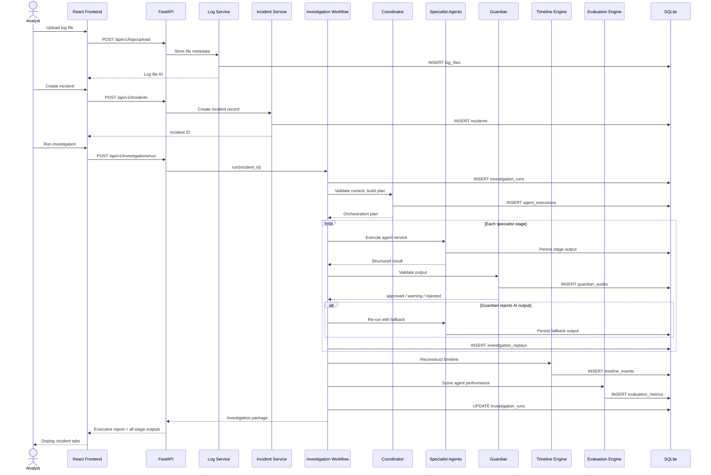

# Sequence Diagram

**Related:** [System Overview](01_system_overview.md) · [Component Diagram](02_component_diagram.md) · [Agent Workflow](04_agent_workflow.md)

Scenario: analyst uploads logs, creates an incident, runs an investigation, and receives an executive report.

---

## Investigation Sequence

---

## Key Endpoints

| Step | Method | Path |
|------|--------|------|
| Upload log | `POST` | `/api/v1/logs/upload` |
| Create incident | `POST` | `/api/v1/incidents` |
| Run investigation | `POST` | `/api/v1/investigations/run` |
| View replay | `GET` | `/api/v1/investigations/{run_id}/replay` |
| View evaluation | `GET` | `/api/v1/evaluation` |

---

## Behavioral Notes

- Creating an incident does **not** automatically start the agent pipeline.
- The workflow runs synchronously in the HTTP request thread.
- Replay steps record `ai_used` and `fallback_used` for each stage.
- Guardian may trigger a single retry with Gemini disabled before accepting fallback output.

See [04_agent_workflow.md](04_agent_workflow.md) for agent-level detail.
