# Database Design

**Related:** [System Overview](01_system_overview.md) · [Agent Workflow](04_agent_workflow.md) · [Deployment](09_deployment.md)

Oz AI persists data in SQLite with sixteen tables. All agent outputs link to an `incidents` record. Investigation runs and replay steps provide workflow traceability.

---

## Entity-Relationship Diagram

```mermaid
erDiagram
    INCIDENTS ||--o| INVESTIGATIONS : has
    INCIDENTS ||--o{ INVESTIGATION_RUNS : has
    INCIDENTS ||--o{ LOG_FILES : has
    INCIDENTS ||--o{ EVIDENCE : has
    INCIDENTS ||--o{ THREAT_INTELLIGENCE_FINDINGS : has
    INCIDENTS ||--o{ MITRE_FINDINGS : has
    INCIDENTS ||--o{ RISK_ASSESSMENTS : has
    INCIDENTS ||--o{ RESPONSE_PLANS : has
    INCIDENTS ||--o{ EXECUTIVE_REPORTS : has
    INCIDENTS ||--o{ GUARDIAN_AUDITS : has
    INCIDENTS ||--o{ TIMELINE_EVENTS : has
    INVESTIGATION_RUNS ||--o{ INVESTIGATION_REPLAYS : has
    INCIDENTS ||--o{ AGENT_EXECUTIONS : has

    INCIDENTS {
        uuid id PK
        string title
        string severity
        string status
        float confidence_score
        datetime created_at
    }

    LOG_FILES {
        uuid id PK
        uuid incident_id FK
        string original_filename
        string storage_path
        string checksum_sha256
        datetime uploaded_at
    }

    EVIDENCE {
        uuid id PK
        uuid incident_id FK
        string evidence_type
        string filename
        json metadata
    }

    THREAT_INTELLIGENCE_FINDINGS {
        uuid id PK
        uuid incident_id FK
        string ioc_type
        string ioc_value
        string reputation
    }

    MITRE_FINDINGS {
        uuid id PK
        uuid incident_id FK
        string technique_id
        string technique_name
        string tactic
    }

    RISK_ASSESSMENTS {
        uuid id PK
        uuid incident_id FK
        string overall_risk
        float risk_score
        text narrative
    }

    RESPONSE_PLANS {
        uuid id PK
        uuid incident_id FK
        string priority
        json containment
        json recovery
    }

    EXECUTIVE_REPORTS {
        uuid id PK
        uuid incident_id FK
        json report_data
        text markdown_content
    }

    GUARDIAN_AUDITS {
        uuid id PK
        uuid incident_id FK
        string agent_name
        string validation_status
        json issues_found
    }

    TIMELINE_EVENTS {
        uuid id PK
        uuid incident_id FK
        datetime event_time
        string description
        string source
    }

    INVESTIGATIONS {
        uuid id PK
        uuid incident_id FK
        string investigation_status
        datetime started_at
        datetime completed_at
    }

    INVESTIGATION_RUNS {
        uuid id PK
        uuid incident_id FK
        string status
        int duration_ms
        text agents_completed
    }

    INVESTIGATION_REPLAYS {
        uuid id PK
        uuid investigation_run_id FK
        int step_number
        string agent_name
        bool ai_used
        bool fallback_used
    }

    EVALUATION_METRICS {
        uuid id PK
        string agent_name
        int execution_time_ms
        bool success
        float confidence
    }

    AGENT_EXECUTIONS {
        uuid id PK
        uuid incident_id FK
        uuid workflow_id
        string agent_name
        string status
    }

    AUDIT_LOGS {
        uuid id PK
        string action
        string entity_type
        uuid entity_id
        json details
    }
```

---

## Core Entities

### Incident

Central entity. All investigation artifacts link to an incident via `incident_id`. Supports soft delete via `deleted_at`.

### Log File

Uploaded log metadata and disk storage path. Linked to an incident. Binary content stored in `storage/uploads/`, not in the database.

### Evidence

Normalized log summary produced by the Evidence Agent. Contains raw data reference and JSON metadata.

### Threat Intelligence Finding

Individual IOC records with reputation labels and enrichment context.

### MITRE Finding

ATT&CK technique mapping with confidence and matched evidence reference.

### Risk Assessment

Enterprise risk score, level, and narrative produced by the Risk Agent.

### Response Plan

Structured containment, eradication, recovery, and monitoring recommendations.

### Executive Report

Leadership-ready JSON report and generated Markdown content.

### Guardian Audit

Append-only validation record for each Guardian check. Includes status, issues, and action taken.

### Timeline Event

Chronological event extracted by the Timeline Engine from agent outputs.

### Evaluation Metric

Agent execution measurement for health scoring. Not directly linked to incidents — aggregated by agent name.

---

## Workflow Entities

### Investigation

One-to-one with an incident. Tracks overall investigation status and duration.

### Investigation Run

Records a complete workflow execution triggered by `POST /investigations/run`. Stores completed and failed agent lists as JSON text.

### Investigation Replay

Step-by-step trace linked to an investigation run. Records timing, summaries, `ai_used`, and `fallback_used` flags.

### Agent Execution

Coordinator and standalone agent invocation records. Linked by `workflow_id` for correlation.

### Audit Log

General-purpose immutable audit trail for system actions (separate from Guardian audits).

---

## Relationships

| From | To | Cardinality | Notes |
|------|----|-------------|-------|
| Incident | Investigation | 1:1 | One active investigation record per incident |
| Incident | Investigation Run | 1:N | Multiple runs allowed (re-investigation) |
| Investigation Run | Investigation Replay | 1:N | Ordered by `step_number` |
| Incident | Log File | 1:N | Logs optionally linked at upload |
| Incident | All agent outputs | 1:N | Evidence, findings, plans, reports, audits, timeline |
| Incident | Agent Execution | 1:N | Nullable `incident_id` for standalone runs |

Cascade deletes propagate from `incidents` to dependent records via `ON DELETE CASCADE`.

---

## Schema Location

| Artifact | Path |
|----------|------|
| ORM models | `backend/app/models/` |
| Enums | `backend/app/models/enums.py` |
| Migrations | Application startup via `init_db()` |
| Table listing API | `GET /api/v1/system/tables` |

Production migration path: PostgreSQL with connection string change only (SQLAlchemy abstraction). See [10_decision_records.md](10_decision_records.md).
