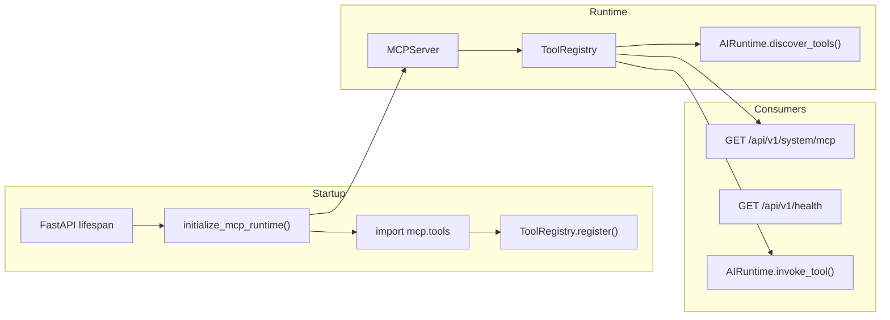

# MCP Architecture

**Related:** [Component Diagram](02_component_diagram.md) · [ADK Runtime](07_adk_runtime.md) · [Decision Records](10_decision_records.md)

Oz AI implements an in-process Model Context Protocol (MCP) tool layer. Five operational tools are registered at startup and exposed through the AI runtime and REST introspection endpoints.

---

## Architecture Overview

---

## Tool Registry

Location: `mcp/registry.py`

The registry stores tool definitions with typed input/output schemas:

| Field | Description |
|-------|-------------|
| `name` | Unique tool identifier |
| `description` | Human-readable purpose |
| `version` | Semantic version (default `1.0.0`) |
| `input_model` | Pydantic input schema |
| `output_model` | Pydantic output schema |
| `handler` | Callable `(input, db_session) → output` |

Registration uses the `@register_tool` decorator. Duplicate names raise `ValueError`.

The process-wide singleton is accessed via `get_registry()`.

---

## Registered Tools

| Tool | Description | Handler Location |
|------|-------------|------------------|
| `health` | Return application health status | `mcp/tools/health.py` |
| `list_incidents` | Return paginated incident list with filters | `mcp/tools/incidents.py` |
| `incident_details` | Return single incident by ID | `mcp/tools/incidents.py` |
| `list_logs` | Return uploaded log file metadata | `mcp/tools/logs.py` |
| `system_info` | Return version, database, ADK, and MCP status | `mcp/tools/system.py` |

All handlers delegate to existing service layers (`IncidentService`, `LogService`) — no duplicate business logic.

---

## Tool Discovery

Discovery occurs during AI runtime initialization:

1. `initialize_mcp_runtime()` starts the MCP server and imports `mcp.tools`
2. Decorators register handlers into the global registry
3. `AIRuntime.initialize()` calls `_discover_tools()` to enumerate registered tools
4. Tool metadata (name, description, version, JSON schemas) is cached in the runtime

Discovery output is logged at startup and included in health status fields:

- `registered_tools` count on `GET /api/v1/health`
- Full tool list on `GET /api/v1/system/mcp`

---

## Tool Invocation

Invocation path: `AIRuntime.invoke_tool(name, payload, db)`

1. Registry looks up the tool by name
2. Input payload is validated against `input_model`
3. Handler executes with the database session
4. Output is validated against `output_model`
5. Result wrapped in `ToolResult[success, data, error]`
6. Latency recorded in runtime metrics

Direct invocation is available to the AI runtime. **Agents do not call MCP tools at runtime in v0.1.0** — they invoke backend services directly. MCP is infrastructure for introspection and future agent-tool integration.

---

## MCP Server Lifecycle

Location: `mcp/server.py`

| Phase | Behavior |
|-------|----------|
| **Start** | Import tool modules, log registrations, set `_running = True` |
| **Status** | `is_running()` returns server state |
| **Singleton** | `get_mcp_server()` returns process-wide instance |

Initialized in FastAPI lifespan via `backend/app/core/mcp_runtime.py`.

---

## REST Introspection

| Endpoint | Returns |
|----------|---------|
| `GET /api/v1/system/mcp` | MCP running status, tool count, tool names |
| `GET /api/v1/health` | Includes `mcp: true`, `registered_tools: 5` |
| `GET /api/v1/ai/runtime` | Agent and tool inventory via AI runtime |

---

## Future Extension Points

| Extension | Description |
|-----------|-------------|
| **Domain tools** | `evidence_collector`, `threat_intel_lookup`, `mitre_mapper` — planned for v1.0.0 |
| **Agent invocation via MCP** | Replace direct service calls with tool calls for decoupled agent I/O |
| **Permission enforcement** | Tool-level access control when authentication is added |
| **External MCP servers** | Connect remote tool providers alongside in-process registry |
| **Tool versioning** | Semantic versioning with backward-compatible schema evolution |

See ADR-004 in [10_decision_records.md](10_decision_records.md) for the current service-layer integration decision.

Legacy reference: [`mcp-interaction.md`](mcp-interaction.md)
