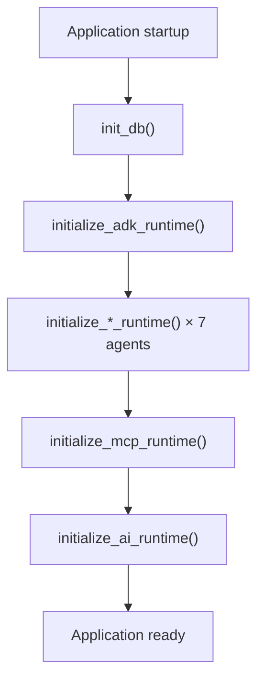
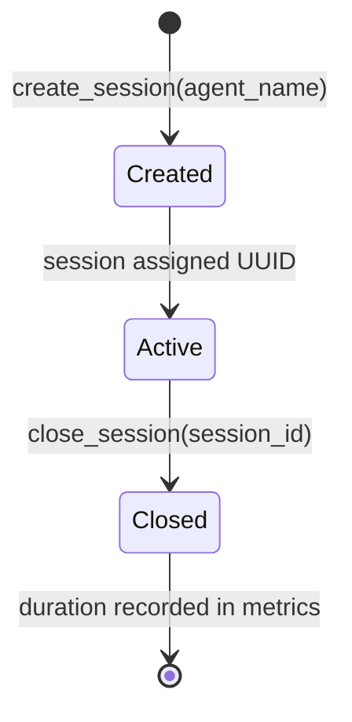
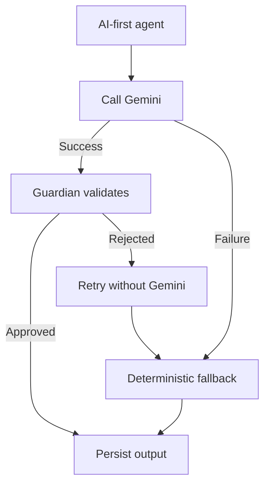

# Google ADK Runtime

**Related:** [Component Diagram](02_component_diagram.md) · [Agent Workflow](04_agent_workflow.md) · [MCP Architecture](06_mcp_architecture.md) · [Security Architecture](08_security_architecture.md)

Oz AI uses Google Agent Development Kit (ADK) for agent configuration and the Coordinator Agent. LLM inference for AI-first agents uses `google-genai` (Gemini) through a centralized provider, not ADK session checkpointing.

---

## Runtime Initialization

Startup sequence in FastAPI lifespan (`backend/app/main.py`):



### ADK Runtime (`backend/app/core/adk_runtime.py`)

1. **Verify import** — `verify_adk_installed()` confirms `google.adk` is available
2. **Initialize Coordinator** — `CoordinatorAgent().initialize()` sets `_coordinator_loaded`
3. **Expose status** — `get_adk_status()` returns `{adk, coordinator}` booleans

Each specialist agent has a dedicated runtime initializer in `backend/app/core/` (evidence, threat intelligence, mitre, risk, response, executive report, guardian).

### AI Runtime (`backend/app/ai/runtime.py`)

1. Build default agent registry (eight agents with metadata)
2. Discover MCP tools via registry enumeration
3. Initialize `GeminiProvider` and `SessionManager`
4. Set `_ready = True`

Health endpoint exposes: `adk`, `coordinator`, `runtime`, `registered_agents`, `registered_tools`.

---

## Session Lifecycle

Location: `backend/app/ai/session.py`

ADK sessions track agent execution duration. They are **in-memory only** — not persisted across process restarts.



| Method | Behavior |
|--------|----------|
| `SessionManager.create_session()` | Creates `ADKSession` with UUID, logs creation |
| `SessionManager.close_session()` | Records elapsed ms, updates runtime metrics |
| `SessionManager.active_session_count()` | Returns open session count |

**Limitation:** ADK native session checkpointing is not implemented. Workflow state persists in SQLite via services, not ADK sessions.

---

## Agent Registration

Location: `backend/app/ai/registry.py`

Eight agents registered at startup:

| Agent | Description |
|-------|-------------|
| Coordinator Agent | Orchestrates investigation workflows |
| Evidence Agent | Collects and normalizes log evidence |
| Threat Intelligence Agent | Enriches IOCs with threat intelligence |
| MITRE Mapping Agent | Maps evidence to MITRE ATT&CK |
| Risk Assessment Agent | Assesses incident severity and business impact |
| Response Planning Agent | Generates containment and remediation plans |
| Executive Report Agent | Produces technical and executive summaries |
| Guardian Agent | Validates outputs for safety, PII, and injection |

Each agent has:
- ADK configuration in `agents/*/agent.py`
- Service layer in `agents/*/service.py` and `backend/app/services/*_agent_service.py`
- Pydantic input/output schemas

---

## Gemini Integration

Location: `backend/app/ai/provider.py`

| Configuration | Variable | Default |
|---------------|----------|---------|
| API key | `GOOGLE_API_KEY` | *(empty)* |
| Model | `GOOGLE_MODEL` | `gemini-2.5-pro` |
| App identifier | `ADK_APP_NAME` | `oz_ai` |
| Tracing | `ADK_ENABLE_TRACING` | `false` |

### Provider behavior

- `GeminiProvider.get_client()` returns `None` when no API key is configured
- `generate_text()` — plain-text prompts for connectivity tests
- `generate_json()` — JSON-mode responses for structured agent outputs
- Errors (quota, auth, timeout) are logged and return `None`

### AI-first agents

These agents call Gemini via their service layer `_call_gemini` methods:

- Threat Intelligence
- Risk Assessment
- Response Planning
- Executive Report

### Connectivity test

`GET /api/v1/ai/test` sends a minimal Gemini probe and returns structured status including quota and auth errors.

---

## Fallback Strategy

When Gemini is unavailable (missing key, quota exceeded, timeout, invalid JSON, or Guardian rejection), agents use deterministic fallbacks:



| Agent | Fallback Module |
|-------|-----------------|
| Threat Intelligence | `agents/threat_intelligence/fallback.py`, `reputation_engine.py` |
| Risk Assessment | `agents/risk/fallback.py` |
| Response Planning | `agents/response/fallback.py` |
| Executive Report | `agents/executive_report/fallback.py`, `markdown_generator.py` |

Guardian integration (`orchestration_guardian.py`) may patch `_call_gemini` to return `None` on retry, forcing fallback execution.

The workflow **never blocks** on AI failure. Replay steps record `ai_used` and `fallback_used` for transparency.

---

## Configuration Reference

```bash
GOOGLE_API_KEY=          # Optional — enables Gemini enrichment
GOOGLE_MODEL=gemini-2.5-pro
ADK_APP_NAME=oz_ai
ADK_ENABLE_TRACING=false
```

Offline demos work fully without `GOOGLE_API_KEY` via `python scripts/reset_demo.py`.

See [04_agent_workflow.md](04_agent_workflow.md) for per-agent AI/fallback detail.
