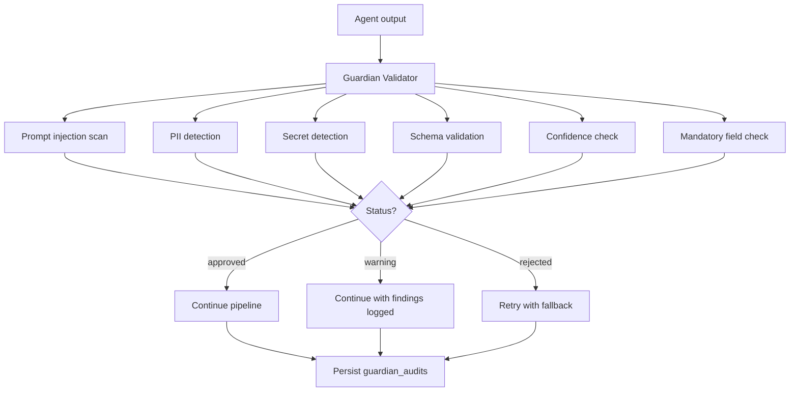

# Security Architecture

**Related:** [Agent Workflow](04_agent_workflow.md) · [ADK Runtime](07_adk_runtime.md) · [Database Design](05_database_design.md)

Oz AI implements security controls through the Guardian Agent, applied between every specialist workflow stage. The system is a decision-support platform — it does not execute remediation actions.

---

## Security Overview

---

## Guardian Agent

Location: `agents/guardian/validator.py`

The Guardian Agent is a rule-based validator — no LLM invocation. It runs automatically via `orchestration_guardian.run_stage_with_guardian` after each specialist stage and can be invoked directly at `POST /api/v1/agents/guardian/validate`.

### Validation pipeline

1. Check for empty responses
2. Scan for prompt injection patterns
3. Detect and optionally mask PII
4. Detect and optionally mask secrets
5. Validate JSON schema per agent type
6. Check mandatory field completeness
7. Enforce confidence threshold
8. Persist audit record

### Validation statuses

| Status | Behavior |
|--------|----------|
| `approved` | Output passes all checks; pipeline continues |
| `warning` | Non-blocking issues found; pipeline continues |
| `rejected` | Blocking issues; triggers retry or fallback |

### Agent schemas

Guardian validates against agent-specific Pydantic models defined in `AGENT_SCHEMAS` and `MANDATORY_FIELDS` in `validator.py`.

---

## PII Masking

Location: `agents/guardian/pii_detector.py`

| Setting | Default | Behavior |
|---------|---------|----------|
| `MASK_PII` | `true` | Detect and mask PII in agent outputs |

Detected patterns include email addresses, phone numbers, social security numbers, and credit card numbers. Masked values replace sensitive substrings before outputs reach the UI or persist to non-audit tables.

Function: `mask_pii_in_response()` applied during validation when masking is enabled.

---

## Secret Masking

Location: `agents/guardian/secret_detector.py`

| Setting | Default | Behavior |
|---------|---------|----------|
| `MASK_SECRETS` | `true` | Detect and mask secrets in agent outputs |

Detected patterns include API keys, bearer tokens, AWS credentials, private keys, and common secret formats. Masked values prevent accidental exposure in reports and API responses.

Function: `mask_secrets_in_response()` applied during validation.

---

## Prompt Injection Detection

Location: `agents/guardian/prompt_injection.py`

Scans agent outputs for patterns indicating prompt injection attempts:

- Instruction override phrases
- Role manipulation attempts
- System prompt extraction patterns
- Delimiter escape sequences

Function: `scan_response_for_injection()` returns detected patterns. Injection findings contribute to rejection or warning status.

---

## Confidence Validation

Location: `agents/guardian/confidence.py`

| Setting | Default | Behavior |
|---------|---------|----------|
| `MIN_AI_CONFIDENCE` | `70` | Minimum acceptable AI confidence score |

AI-first agent outputs include confidence scores. Guardian rejects outputs below the threshold, triggering retry with fallback execution.

Function: `validate_confidence()` compares agent confidence against configured minimum.

---

## Audit Trail

Two audit mechanisms persist security events:

### Guardian Audits (`guardian_audits` table)

| Field | Description |
|-------|-------------|
| `agent_name` | Validated agent |
| `validation_status` | `approved`, `warning`, or `rejected` |
| `issues_found` | JSON list of detected issues |
| `action_taken` | Description of Guardian action |
| `incident_id` | Linked incident (nullable) |
| `created_at` | Timestamp |

Every validation event is persisted regardless of outcome.

### System Audit Logs (`audit_logs` table)

General-purpose immutable trail for system actions (entity creation, updates). Separate from Guardian-specific audits.

---

## Configuration

| Variable | Default | Purpose |
|----------|---------|---------|
| `GUARDIAN_ENABLED` | `true` | Enable/disable Guardian validation |
| `MIN_AI_CONFIDENCE` | `70` | Confidence threshold |
| `MASK_PII` | `true` | PII detection and masking |
| `MASK_SECRETS` | `true` | Secret detection and masking |

When `GUARDIAN_ENABLED=false`, validation is bypassed but audit records may still be written for traceability.

Configuration source: `backend/app/core/guardian_config.py`, `.env.example`

---

## Security Limitations

| Limitation | Detail |
|------------|--------|
| No API authentication | All endpoints are unauthenticated in v0.1.0 |
| No RBAC | No role-based access control |
| No rate limiting | Ingestion endpoints lack throttling |
| No automated remediation | Response plans are recommendations only |
| Guardian is rule-based | Novel injection patterns may not be detected |

Full list: [`docs/kaggle/limitations.md`](../kaggle/limitations.md)

Implementation: [`agents/guardian/`](../../agents/guardian/) · [`backend/app/services/orchestration_guardian.py`](../../backend/app/services/orchestration_guardian.py)
