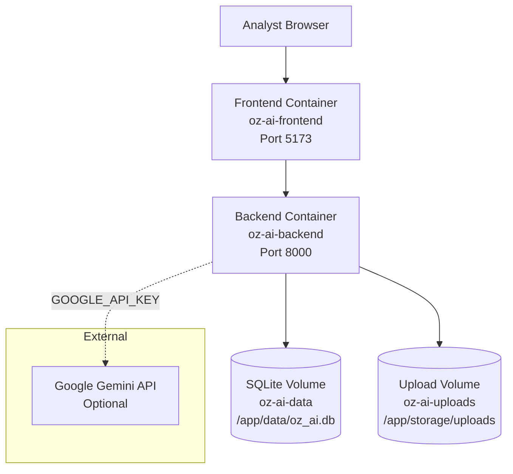

# Deployment Architecture

**Related:** [System Overview](01_system_overview.md) · [Component Diagram](02_component_diagram.md) · [Database Design](05_database_design.md)

Oz AI deploys as a two-service Docker Compose stack with persistent volumes for the SQLite database and uploaded log files.

---

## Deployment Topology



---

## Services

| Service | Container | Port | Image |
|---------|-----------|------|-------|
| **Backend** | `oz-ai-backend` | **8000** | `docker/Dockerfile.backend` |
| **Frontend** | `oz-ai-frontend` | **5173** | `docker/Dockerfile.frontend` |

### Backend

- FastAPI application with uvicorn
- Includes `agents/`, `mcp/`, `evaluation/` packages
- Health check: `curl -f http://localhost:8000/api/v1/health`
- Restart policy: `unless-stopped`

### Frontend

- Vite development server (not production Nginx build)
- Proxies API requests to backend via `VITE_API_URL`
- Depends on backend health check before starting
- Health check: `wget -q --spider http://localhost:5173`

---

## Volumes

| Volume | Mount Path | Purpose |
|--------|------------|---------|
| `oz-ai-data` | `/app/data` | SQLite database file |
| `oz-ai-uploads` | `/app/storage/uploads` | Uploaded log files |

Volumes persist data between container restarts and rebuilds.

---

## Environment Variables (Docker)

Set in `docker-compose.yml`:

| Variable | Docker Value |
|----------|--------------|
| `DATABASE_URL` | `sqlite:////app/data/oz_ai.db` |
| `UPLOAD_DIR` | `storage/uploads` |
| `HOST` | `0.0.0.0` |
| `PORT` | `8000` |
| `MAX_UPLOAD_SIZE_BYTES` | `52428800` (50 MB) |
| `GUARDIAN_ENABLED` | `true` |
| `MASK_SECRETS` | `true` |
| `MASK_PII` | `true` |
| `GOOGLE_API_KEY` | *(empty by default)* |
| `GOOGLE_MODEL` | `gemini-2.5-pro` |
| `VITE_API_URL` | `http://localhost:8000` |

For local development outside Docker, copy `.env.example` to `.env`.

---

## Quick Deploy

```bash
cp .env.example .env
docker compose up --build
```

| URL | Service |
|-----|---------|
| http://localhost:5173 | Frontend dashboard |
| http://localhost:8000 | Backend API |
| http://localhost:8000/docs | Swagger UI |
| http://localhost:8000/api/v1/health | Health check |

Verify:

```bash
docker compose ps
curl http://localhost:8000/api/v1/health
```

---

## Local Development (Non-Docker)

| Service | Command | Port |
|---------|---------|------|
| Backend | `./scripts/dev-backend.sh` | 8000 |
| Frontend | `./scripts/dev-frontend.sh` | 5173 |
| Both | `./scripts/dev.sh` | 8000 + 5173 |

Backend requires a pre-built venv: `cd backend && uv sync`

Frontend requires Node.js 20+: `cd frontend && npm install`

---

## Network Flow

```text
Browser → localhost:5173 (Vite)
              ↓ proxy /api/*
         localhost:8000 (FastAPI)
              ↓
         SQLite + file storage
              ↓ (optional)
         Google Gemini API
```

---

## Deployment Limitations

| Limitation | Detail |
|------------|--------|
| Single instance | No horizontal scaling or load balancer |
| Vite dev server | Docker frontend is not a static production build |
| SQLite | Not suitable for concurrent multi-user production workloads |
| No TLS | HTTPS termination not configured in Compose |
| No secrets manager | API keys passed via environment variables |

Production path (v0.2.0+): PostgreSQL, Nginx static frontend, bearer-token auth, health-checked production images. See [10_decision_records.md](10_decision_records.md).

Configuration file: [`docker-compose.yml`](../../docker-compose.yml)
