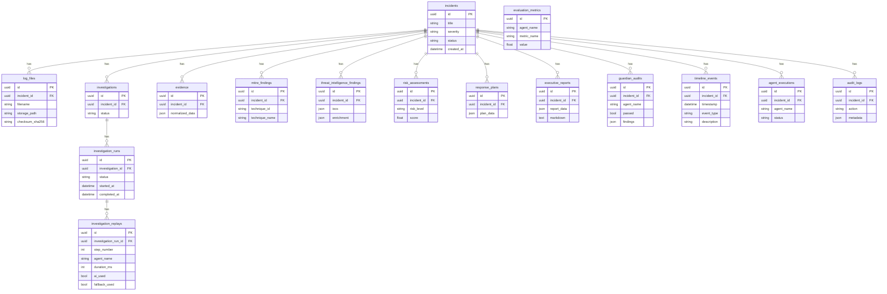

# Database Entity-Relationship Diagram

Oz AI uses SQLite with SQLAlchemy ORM. Sixteen tables model incidents, investigations, agent outputs, audit trails, and evaluation metrics.

## ER diagram

## Table inventory

| Table | Purpose |
|-------|---------|
| `incidents` | Core incident records |
| `log_files` | Uploaded log metadata and storage paths |
| `investigations` | Investigation session records |
| `investigation_runs` | Workflow execution runs |
| `investigation_replays` | Step-by-step replay for explainability |
| `evidence` | Normalized evidence from Evidence Agent |
| `mitre_findings` | MITRE ATT&CK technique mappings |
| `threat_intelligence_findings` | IOC extraction and enrichment |
| `risk_assessments` | Risk scores and narratives |
| `response_plans` | Structured response recommendations |
| `executive_reports` | Executive summaries (JSON + Markdown) |
| `guardian_audits` | Guardian validation results |
| `timeline_events` | Reconstructed incident timeline |
| `agent_executions` | Per-agent execution tracking |
| `audit_logs` | Append-only audit trail |
| `evaluation_metrics` | Agent evaluation benchmark results |

## Implementation

- Models: `backend/app/models/`
- Repositories: `backend/app/repositories/`
- Schema introspection: `GET /api/v1/system/tables`
