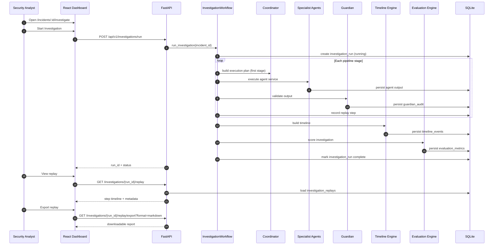

# Investigation Sequence

End-to-end sequence for a full investigation run from dashboard trigger through replay export.

## Sequence diagram

## API flow

| Step | Endpoint | Purpose |
|------|----------|---------|
| 1 | `POST /api/v1/logs/upload` | Upload incident logs |
| 2 | `POST /api/v1/investigations/run` | Start full pipeline |
| 3 | `GET /api/v1/investigations/runs/{run_id}` | Poll run status |
| 4 | `GET /api/v1/incidents/{id}/timeline` | View timeline |
| 5 | `GET /api/v1/investigations/{run_id}/replay` | Step replay |
| 6 | `GET /api/v1/investigations/{run_id}/explain` | Explainability metadata |
| 7 | `GET /api/v1/evaluation` | Agent evaluation dashboard |

## Failure handling

- **Gemini unavailable** — Agents fall back to deterministic rules; workflow continues.
- **Guardian rejection** — Stage marked with findings; workflow may continue with fallback output.
- **Missing logs** — Investigation returns 404 or validation error before pipeline starts.

See [`agent-workflow.md`](agent-workflow.md) for the agent order and [`02_ARCHITECTURE.md`](../02_ARCHITECTURE.md) for service boundaries.
