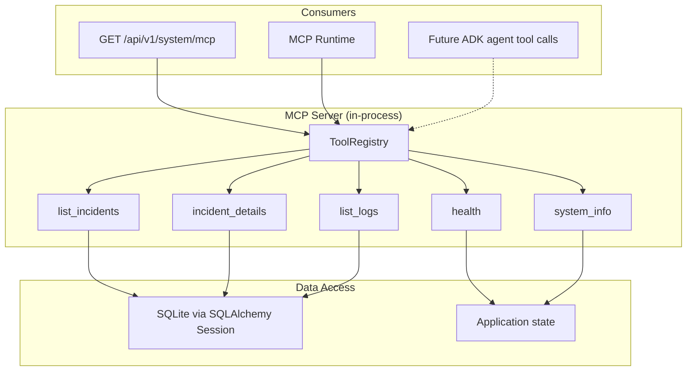
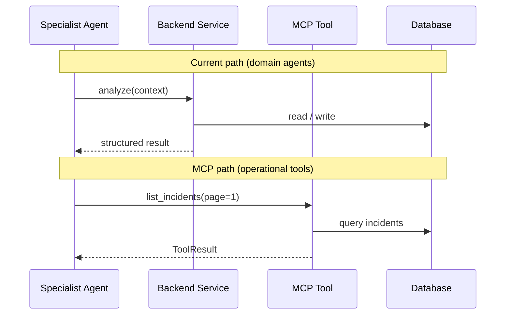

# MCP Interaction Model

Oz AI implements an in-process MCP (Model Context Protocol) tool registry. Five operational tools are registered at startup and exposed via the MCP runtime and system API.

## Tool registry

## Registered tools

| Tool | Description | Input |
|------|-------------|-------|
| `health` | Application health status | None |
| `list_incidents` | Paginated incident list | `page`, `page_size` |
| `incident_details` | Single incident by ID | `incident_id` |
| `list_logs` | Uploaded log file metadata | `incident_id` (optional) |
| `system_info` | Version, database, ADK, MCP status | None |

## Runtime vs direct service calls

Today, investigation agents invoke backend **services directly** for domain logic. MCP tools provide operational introspection and a foundation for future ADK-native tool wiring.

## Implementation locations

| Component | Path |
|-----------|------|
| Registry | `mcp/registry.py` |
| Server lifecycle | `mcp/server.py` |
| Tool modules | `mcp/tools/` |
| Runtime integration | `backend/app/core/mcp_runtime.py` |
| API exposure | `backend/app/api/v1/system.py` |

## Planned expansion (Sprint 4+)

Domain MCP tools (`evidence_collector`, `threat_intel_lookup`, etc.) are documented in `docs/02_ARCHITECTURE.md` and `docs/03_TASKS.md` but not yet implemented.
