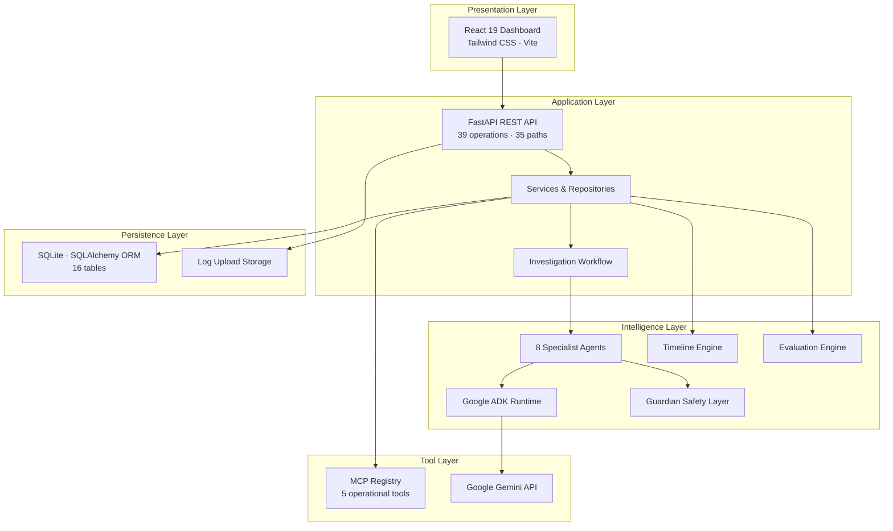

# System Architecture

Oz AI follows a layered architecture: React dashboard → FastAPI backend → specialist agents → SQLite persistence.

## High-resolution diagram

## Layer overview

## Design principles

1. **Explicit orchestration** — Investigations start via `POST /api/v1/investigations/run`, not on incident creation.
2. **Guardian between stages** — Every agent output is validated before the next stage proceeds.
3. **AI-first with fallback** — Agents use Gemini when available; deterministic fallbacks keep demos offline-capable.
4. **Append-only audit** — Audit and guardian records are never modified after creation.
5. **Human-in-the-loop** — Response actions require approval (API enforcement planned Sprint 4).

## Related documents

- [`agent-workflow.md`](agent-workflow.md)
- [`02_ARCHITECTURE.md`](../02_ARCHITECTURE.md)
