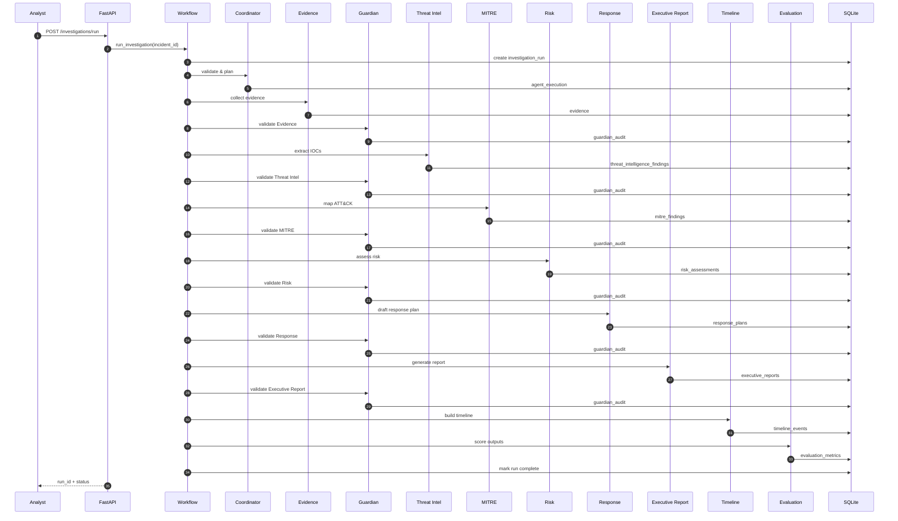

# Agent Sequence

Sequence diagram for a full investigation run with Guardian validation at each stage.

## Agent execution model

| Agent | AI | Fallback |
|-------|-----|----------|
| Coordinator | No | Validation errors |
| Evidence | No | Empty package |
| Threat Intelligence | Gemini | Offline reputation engine |
| MITRE | No | Empty techniques |
| Risk | Gemini | Rule scoring |
| Response | Gemini | Playbooks |
| Executive Report | Gemini | Templates |
| Guardian | No | Bypass if disabled |

## Replay API

After completion, each step is available via `GET /api/v1/investigations/{run_id}/replay` with `ai_used` and `fallback_used` metadata.
