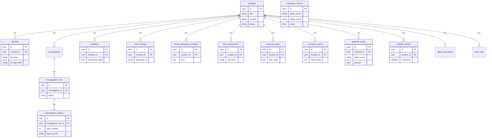

# Database ER Diagram

Entity-relationship model for Oz AI (16 tables).

## Table inventory

| Table | Purpose |
|-------|---------|
| `incidents` | Core incident records |
| `log_files` | Uploaded log metadata |
| `investigations` | Investigation sessions |
| `investigation_runs` | Workflow execution runs |
| `investigation_replays` | Step replay for explainability |
| `evidence` | Evidence Agent output |
| `mitre_findings` | MITRE ATT&CK mappings |
| `threat_intelligence_findings` | IOC enrichment |
| `risk_assessments` | Risk scores |
| `response_plans` | Response recommendations |
| `executive_reports` | Leadership summaries |
| `guardian_audits` | Safety validation results |
| `timeline_events` | Reconstructed timeline |
| `agent_executions` | Per-agent run tracking |
| `audit_logs` | Append-only audit trail |
| `evaluation_metrics` | Benchmark results |

Introspection: `GET /api/v1/system/tables`
