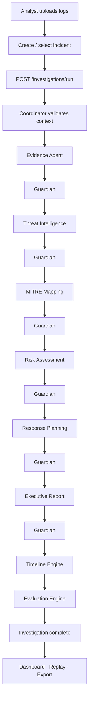

# Investigation Flow

End-to-end investigation workflow from analyst action to evaluation.



## Analyst journey

| Step | Action | Route / API |
|------|--------|-------------|
| 1 | Upload logs | `/logs` · `POST /api/v1/logs/upload` |
| 2 | Open incident | `/incidents/:id` |
| 3 | Start investigation | `/incidents/:id/investigate` · `POST /investigations/run` |
| 4 | Review agent outputs | Incident detail tabs |
| 5 | View timeline | Timeline tab · `GET /incidents/{id}/timeline` |
| 6 | Replay investigation | `/investigations/:runId/replay` |
| 7 | Check evaluation | `/evaluation` |

## Demo reset

```bash
python scripts/reset_demo.py
```

Seeds 10 incidents, 25 logs, and runs investigations on showcase incidents automatically.
