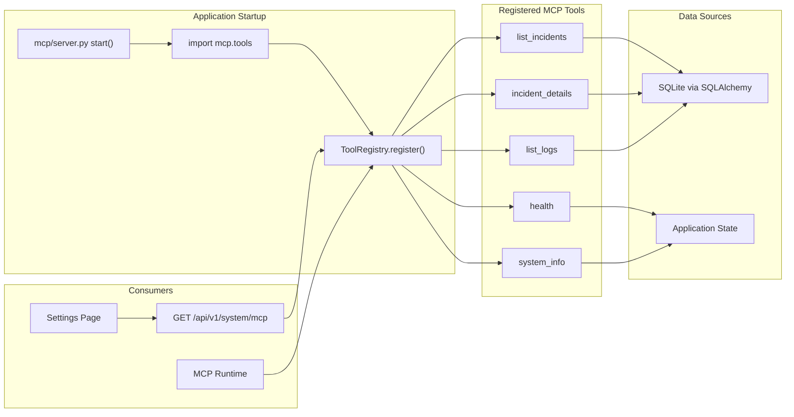
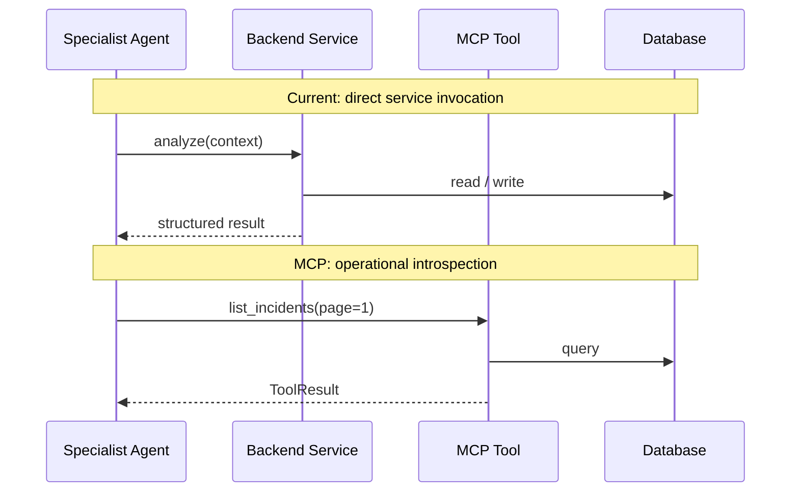

# MCP Flow

Model Context Protocol tool registry and interaction model.

## Tool catalog

| Tool | Description | Handler |
|------|-------------|---------|
| `health` | Application health status | `mcp/tools/health.py` |
| `list_incidents` | Paginated incident list | `mcp/tools/incidents.py` |
| `incident_details` | Single incident by ID | `mcp/tools/incidents.py` |
| `list_logs` | Log file metadata | `mcp/tools/logs.py` |
| `system_info` | Version, ADK, MCP status | `mcp/tools/system.py` |

## Runtime vs agent calls

## Implementation

| Component | Path |
|-----------|------|
| Registry | `mcp/registry.py` |
| Server | `mcp/server.py` |
| Runtime | `backend/app/core/mcp_runtime.py` |
| API | `backend/app/api/v1/system.py` |

Five tools registered at startup. Domain tools (`evidence_collector`, `threat_intel_lookup`) are planned for future sprints.
