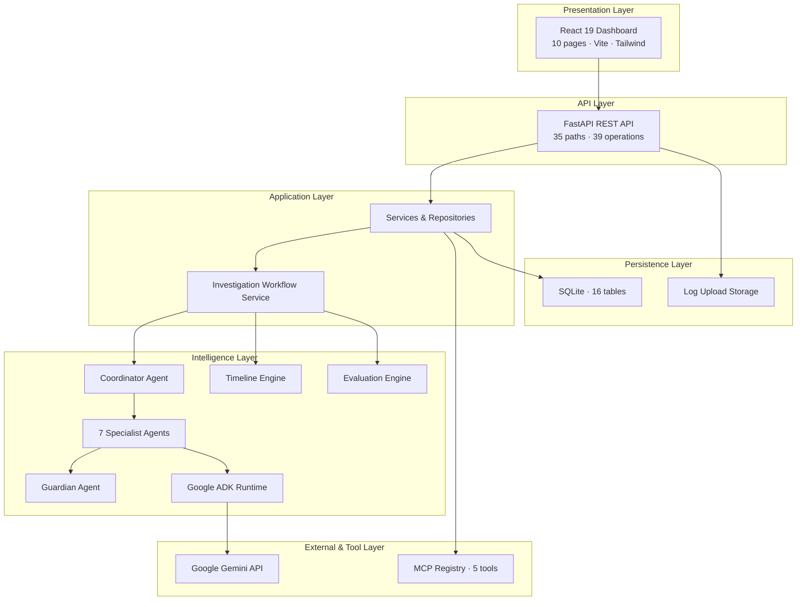

# System Architecture

Oz AI layered architecture for the Kaggle AI Agents Capstone submission.

## Layer summary

| Layer | Technology | Location |
|-------|------------|----------|
| Frontend | React 19, TypeScript | `frontend/src/` |
| Backend | FastAPI, Python 3.12 | `backend/app/` |
| Agents | Google ADK | `agents/` |
| MCP | Custom registry | `mcp/` |
| AI | Gemini via `google.genai` | `backend/app/ai/` |
| Database | SQLite, SQLAlchemy | `backend/app/models/` |

## Design principles

1. Explicit investigation trigger — `POST /api/v1/investigations/run`
2. Guardian validation between every specialist stage
3. AI-first agents with deterministic fallbacks
4. Append-only audit and guardian records
